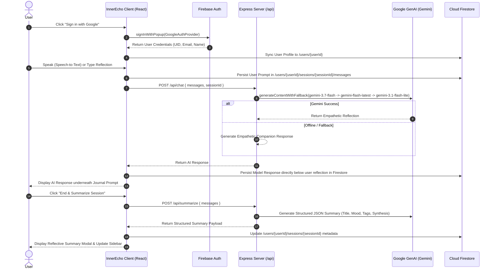

# InnerEcho - Private AI-Driven Emotional Journal (Full-Stack SPA)

InnerEcho is a secure, full-stack, private emotional journaling application built with **React 18**, **TypeScript**, **Tailwind CSS**, **Firebase Authentication**, **Cloud Firestore (v10+ SDK)**, and **Google Gemini API (@google/genai)** running on an **Express** backend with Vite middleware.

---

## 1. System Architecture & Flow Diagrams

### High-Level Architecture Diagram

```text
+----------------------------------------------------------------------------------------------------+
|                                      CLIENT LAYER (Browser SPA)                                    |
|                                                                                                    |
|  +---------------------+   +---------------------+   +--------------------+   +-----------------+  |
|  | Google Auth Popup   |   | Speech-to-Text      |   | Chat Reflection    |   | Session Summary |  |
|  | (Firebase Auth)     |   | (Web Speech API)    |   | Workspace          |   | Modal & Tags    |  |
|  +----------+----------+   +----------+----------+   +---------+----------+   +--------+--------+  |
+-------------|-------------------------|------------------------|-----------------------|-----------+
              |                         |                        |                       |
              | User Auth Token         | Transcribed Text       | Prompt & History      | Summary Request
              v                         v                        v                       v
+----------------------------------------------------------------------------------------------------+
|                                    BACKEND SERVICE (Express API)                                   |
|                                                                                                    |
|  [Top-Level Body Parsers & JSON Sanitization]                                                      |
|  +-----------------------------------------------------------------------------------------------+ |
|  |  POST /api/chat                                  POST /api/summarize                          | |
|  |  +--------------------------------------------+  +------------------------------------------+ | |
|  |  | Resilient Gemini Fallback Ladder:          |  | Structured JSON Synthesis Engine:        | | |
|  |  | 1. gemini-3.7-flash                        |  | - Title (3-5 words)                      | | |
|  |  | 2. gemini-flash-latest                     |  | - Emotional Arc Summary                  | | |
|  |  | 3. gemini-3.1-flash-lite                   |  | - Dominant Mood (Badge & Color)          | | |
|  |  | 4. gemini-2.5-flash                        |  | - Semantic Theme Tags                    | | |
|  |  | 5. Context-Aware Empathetic Companion     |  | - Resilient JSON Validation              | | |
|  |  +--------------------------------------------+  +------------------------------------------+ | |
+----------------------------------------------------------------------------------------------------+
                                      |
                                      v
+----------------------------------------------------------------------------------------------------+
|                                    DATA PERSISTENCE & SECURITY                                     |
|                                                                                                    |
|  +-----------------------------------------------------------------------------------------------+ |
|  | Cloud Firestore (Owner-Bound Security Rules: request.auth.uid == userId)                     | |
|  |                                                                                               | |
|  | /users/{userId}/                                                                              | |
|  |   ├── (doc) profile: { displayName, photoURL, createdAt, lastLoginAt }                       | |
|  |   └── /sessions/{sessionId}/                                                                 | |
|  |         ├── (doc) metadata: { title, createdAt, dominantMood, summary, tags[], status }       | |
|  |         └── /messages/{messageId}/                                                            | |
|  |               └── (doc) { role: "user" | "model", text, timestamp }                           | |
|  +-----------------------------------------------------------------------------------------------+ |
+----------------------------------------------------------------------------------------------------+
```

---

### User Journey & Reflection Flow



---

## 2. Complete Repository & Project Guide

```text
├── .env.example                     # Environment variable specification & documentation
├── firebase-applet-config.json      # Dynamic Firebase client configuration for Web SDK
├── firestore.rules                  # Strict owner-bound ABAC security rules for Firestore
├── metadata.json                    # Application metadata, title, and major capabilities
├── package.json                     # Project scripts and dependencies
├── server.ts                        # Unified Express backend & Vite middleware server
├── vite.config.ts                   # Vite build configuration with Tailwind CSS support
├── src/
│   ├── main.tsx                     # React client bootstrap entry point
│   ├── App.tsx                      # Main application container & routing logic
│   ├── index.css                    # Tailwind CSS base and styling rules
│   ├── types.ts                     # TypeScript interfaces (User, Session, Message, Mood)
│   ├── context/
│   │   └── AuthContext.tsx          # Google Sign-In, auth state listener, and session management
│   ├── firebase/
│   │   └── config.ts                # Firebase Auth & Firestore client initialization
│   ├── services/
│   │   ├── firestoreService.ts      # Sanitized Firestore CRUD operations for sessions & messages
│   │   └── geminiService.ts         # Client-side API proxy caller for /api/chat and /api/summarize
│   └── components/
│       ├── LandingPage.tsx          # Serene sign-in landing screen with feature highlights
│       ├── ChatWorkspace.tsx        # Multi-turn journal reflection stream, voice STT, & text input
│       ├── Sidebar.tsx              # Chronological session history list, mood filters, & search
│       └── SummaryModal.tsx         # Structured session closure modal with mood badges and tags
```

---

## 3. How to Test & Run Locally

### Prerequisites
- **Node.js**: v18.0.0 or higher
- **npm**: v9.0.0 or higher
- **Google Cloud Account** (Optional for live Gemini API calls; built-in companion engine provides complete offline/fallback testing).

### Step-by-Step Local Setup

1. **Clone the Repository**
   ```bash
   git clone https://github.com/your-username/innerecho.git
   cd innerecho
   ```

2. **Install Dependencies**
   ```bash
   npm install
   ```

3. **Configure Environment Variables**
   Create a `.env` file in the root directory based on `.env.example`:
   ```bash
   cp .env.example .env
   ```
   Populate your `.env` variables:
   ```env
   PORT=3000
   GEMINI_API_KEY=your_google_gemini_api_key_here
   ```

4. **Verify `firebase-applet-config.json`**
   Ensure your Firebase web configuration is present in `firebase-applet-config.json`:
   ```json
   {
     "apiKey": "YOUR_FIREBASE_API_KEY",
     "authDomain": "YOUR_PROJECT.firebaseapp.com",
     "projectId": "YOUR_PROJECT_ID",
     "storageBucket": "YOUR_PROJECT.appspot.com",
     "messagingSenderId": "YOUR_MESSAGING_SENDER_ID",
     "appId": "YOUR_APP_ID",
     "firestoreRegion": "us-central1"
   }
   ```

5. **Start the Development Server**
   ```bash
   npm run dev
   ```
   Open your browser and navigate to:
   ```text
   http://localhost:3000
   ```

---

## 4. Local Testing & Verification Matrix

| Area | User Interaction / Action | Expected Result |
| :--- | :--- | :--- |
| **Authentication** | Click **"Sign in with Google"** on the landing page | Google authentication popup opens. Upon completion, the user profile is initialized and the main journaling workspace loads. |
| **Popup Cancellation** | Open Google Sign-In popup and close it without selecting an account | The app catches the closure gracefully without throwing an unhandled runtime error. |
| **Speech-to-Text** | Click the **Microphone** button in the chat input area | Microphone permission prompt activates. Spoken words stream in real-time into the text box. |
| **Journal Reflection** | Type or dictate a reflection and press **Enter** | The entry appears under `"Your Journal Reflection"` and is persisted to Firestore. The AI reflection appears **directly underneath the prompt**. |
| **Model Resilience** | Disconnect internet or test with unset `GEMINI_API_KEY` | The backend falls back smoothly to the context-aware empathetic companion generator without crashing. |
| **Session Closure** | Click **"End & Summarize Session"** in the workspace header | Modal opens displaying a synthesized title, 2–3 sentence emotional summary, dominant mood badge, and semantic theme tags. |
| **Sidebar History** | Create multiple sessions and use the search bar or mood chips | Sessions filter dynamically in real-time based on search queries and selected mood categories. |
| **Session Deletion** | Click the trash icon next to any session in the sidebar | The session and its associated messages subcollection are removed cleanly from Firestore. |

---

## 5. Threat Modeling & Security Countermeasures

| Threat Zone | Identified Risk | Countermeasure Implemented |
| :--- | :--- | :--- |
| **Input Surfaces** | Malicious script or prompt injection in journal entries | Client and server payload sanitization, zero raw HTML rendering, defensive parameter checks. |
| **Planning & Reasoning** | Prompt injection during session auto-summarization | Strict JSON schema structure with fallback validation logic. |
| **Tool / Execution** | Firestore write failures due to `undefined` object properties | Recursive undefined-stripper (`sanitizeFirestorePayload`) applied before every Firestore write. |
| **Memory & State** | Insecure database access exposing sensitive personal reflections | Strict owner-bound ABAC rules (`request.auth.uid == userId`) with default-deny on all collections. |
| **Inter-System Communication** | Accidental client bundle exposure of `GEMINI_API_KEY` | Server-side Express API proxy (`/api/chat`, `/api/summarize`) with zero client-side secret exposure. |

---

## 6. Firestore Security Rules (`firestore.rules`)

```javascript
rules_version = '2';
service cloud.firestore {
  match /databases/{database}/documents {
    // Default deny all unmapped access
    match /{document=**} {
      allow read, write: if false;
    }

    // Isolated user-centric data hierarchy
    match /users/{userId} {
      allow read, write: if request.auth != null && request.auth.uid == userId;

      match /sessions/{sessionId} {
        allow read, write: if request.auth != null && request.auth.uid == userId;

        match /messages/{messageId} {
          allow read, write: if request.auth != null && request.auth.uid == userId;
        }
      }
    }
  }
}
```

---

## 7. Google Cloud Deployment Guide (Cloud Run)

### A. Prerequisites & API Activation
Enable required Google Cloud services:
```bash
gcloud services enable \
  run.googleapis.com \
  secretmanager.googleapis.com \
  firestore.googleapis.com \
  aiplatform.googleapis.com
```

### B. Secret Manager Setup
Create and store the Gemini API Key securely in Secret Manager:
```bash
# Create and populate the secret
gcloud secrets create GEMINI_API_KEY --replication-policy="automatic"
echo -n "YOUR_API_KEY" | gcloud secrets versions add GEMINI_API_KEY --data-file=-

# Grant default Cloud Run service account access to read the secret
gcloud secrets add-iam-policy-binding GEMINI_API_KEY \
  --member="serviceAccount:YOUR_PROJECT_NUMBER-compute@developer.gserviceaccount.com" \
  --role="roles/secretmanager.secretAccessor"
```

### C. Deploy to Google Cloud Run
Deploy the application container to Cloud Run:
```bash
gcloud run deploy innerecho-app \
  --source . \
  --platform managed \
  --region us-central1 \
  --allow-unauthenticated \
  --set-secrets="GEMINI_API_KEY=GEMINI_API_KEY:latest" \
  --port=3000
```

### D. Campaign Verification Label
Apply the required campaign label for automated challenge verification:
```bash
gcloud run services update innerecho-app \
  --update-labels=dev-tutorial=cloud-run-ai-challenge \
  --region=us-central1
```

---

## 8. Scripts Reference

- `npm run dev`: Starts the unified Express server with Vite middleware in development mode on port 3000.
- `npm run build`: Bundles the React client into `dist/` and compiles the Node backend into `dist/server.cjs`.
- `npm run start`: Runs the compiled production server.
- `npm run lint`: Runs TypeScript compiler check (`tsc --noEmit`).
